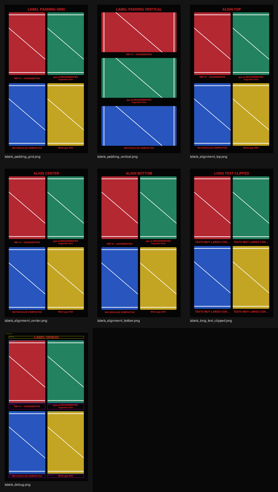
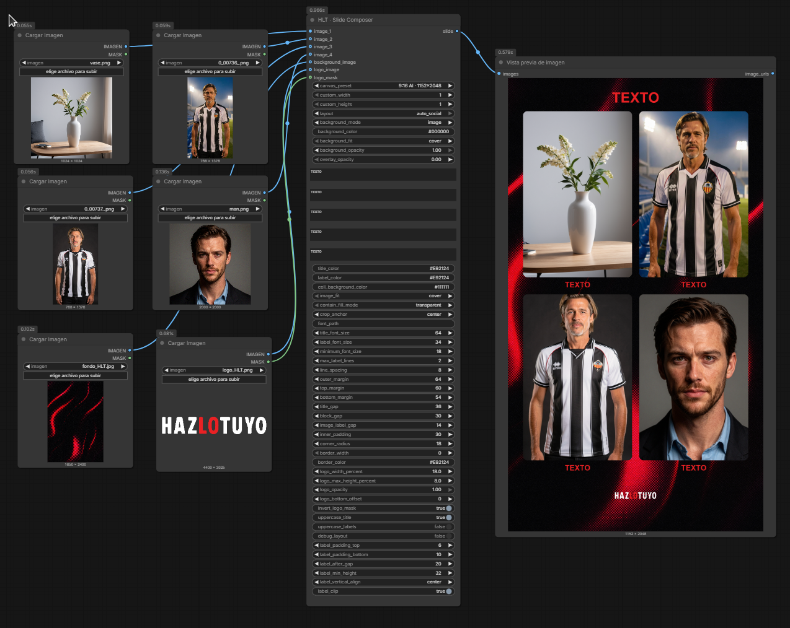
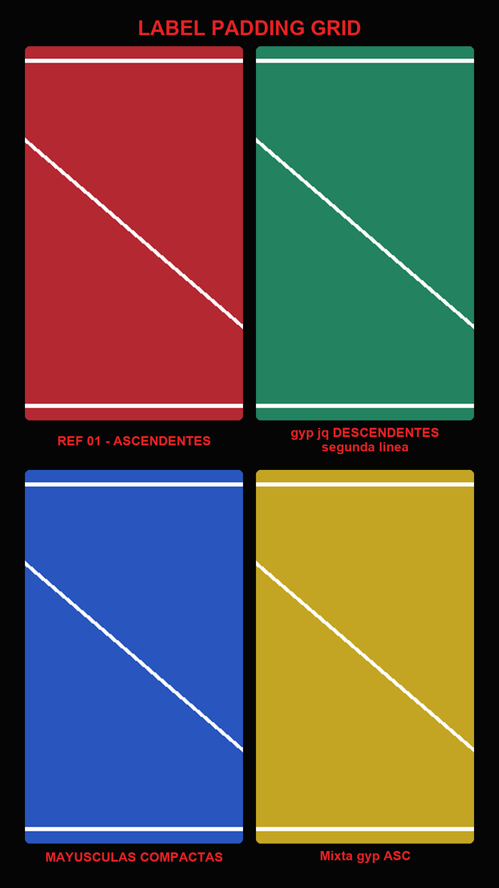
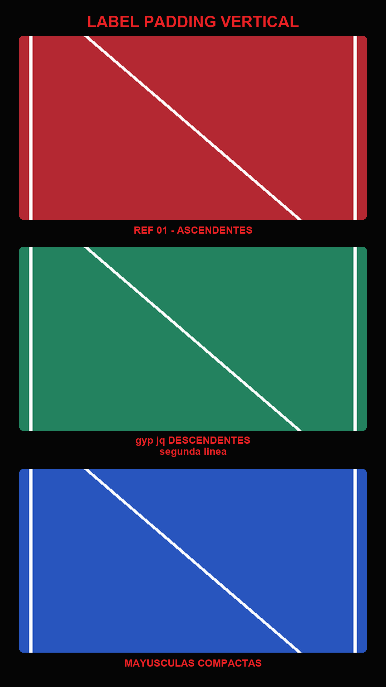
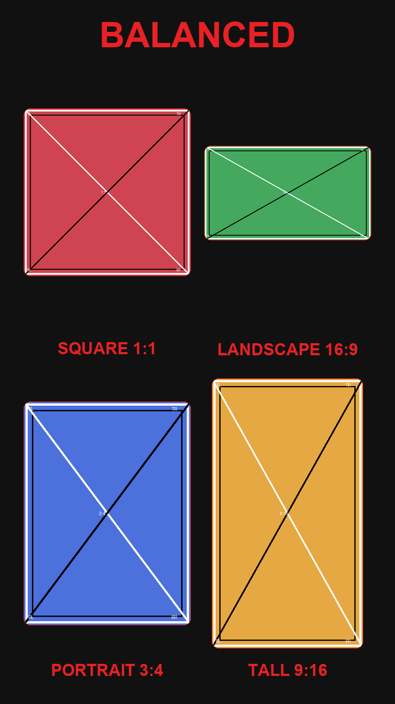

# HLT Slide Composer

HLT Slide Composer is a ComfyUI custom node for composing 1-4 images into editorial slides with titles, labels, backgrounds, overlays and logos.

> Espanol: un nodo para montar slides editoriales directamente dentro de ComfyUI.



## Overview

`HLT · Slide Composer` creates a single finished slide from connected ComfyUI images. It is intended for social stories, visual comparisons, generation reviews, reference sheets, process slides and quick presentation frames.

The node appears under:

```text
HLT / Composition
```

Current prepared release: `v0.3.0`.

It outputs a standard ComfyUI `IMAGE` tensor.

## Screenshots

### Workflow overview



### Grid result



### Vertical result



### Adaptive mosaic



## Features

- 1-4 content images.
- `vertical_stack` layout.
- `grid_2x2` layout.
- `auto_social` layout selector.
- `adaptive_mosaic` layout for mixed aspect ratios.
- `comparison` layout for before/after and debug review slides.
- 9:16, 4:5, 3:4, square and custom canvas sizes.
- Solid or image background.
- Overlay opacity.
- Title and individual labels.
- External logo with alpha or mask.
- `cover`, `contain` and `stretch` image fitting.
- Transparent bands for `contain`.
- Label padding.
- Label spacing.
- Vertical label alignment.
- Label clipping.
- Adaptive strategies: `balanced`, `editorial` and `compact`.
- Automatic or explicit adaptive hero selection.
- Standard ComfyUI `IMAGE` output: `[1, H, W, 3]`, `float32`, range `0.0-1.0`.
- Pure Pillow renderer, kept separate from the ComfyUI adapter.

## Installation

Manual installation:

```powershell
cd "PATH_TO_COMFYUI\ComfyUI\custom_nodes"
git clone https://github.com/alexmihaic/ComfyUI-HLT-SlideComposer.git
```

Then:

1. restart ComfyUI;
2. search for `HLT · Slide Composer`;
3. find it under `HLT / Composition`.

### Dependencies

The node uses:

- Pillow;
- NumPy;
- Torch provided by ComfyUI.

Do not reinstall Torch for this node. If Pillow or NumPy are missing from your ComfyUI environment, install them with that specific ComfyUI Python, not with a global Python installation.

## Update

```powershell
cd "PATH_TO_COMFYUI\ComfyUI\custom_nodes\ComfyUI-HLT-SlideComposer"
git switch main
git pull --ff-only origin main
```

Restart ComfyUI after updating.

## Quick Start

Minimal flow:

```text
Load Image -> image_1
Load Image -> image_2
HLT · Slide Composer
Preview Image
```

Full example flow:

```text
4 x Load Image -> image_1, image_2, image_3, image_4
Load Image -> background_image
Load Image -> logo_image + logo_mask
HLT · Slide Composer
Preview Image
```

Suggested first settings:

```text
canvas_preset = 9:16 Social · 1080x1920
layout = auto_social
style_preset = hlt_editorial_red
background_mode = solid
background_color = #000000
title_color = #E92124
label_color = #E92124
image_fit = cover
crop_anchor = center
```

With four images:

```text
auto_social -> grid_2x2
```

## Style Presets

`style_preset` lets you choose a complete visual direction without adjusting all
spacing and color controls manually.

Available presets:

| Preset | Use |
| --- | --- |
| `custom` | Keeps the current behavior and uses the explicit controls as-is. |
| `hlt_editorial_red` | Black HLT editorial look with red title/labels and dark cells. |
| `hlt_dark_review` | Compact dark review style with quieter labels for generation batches. |
| `hlt_clean_portfolio` | Light portfolio/presentation style with wider margins and dark text. |
| `hlt_poster_bold` | Larger title, more spacing and a stronger poster-like presence. |

Existing controls still work with presets. If you change a color, margin, font
size or radius manually, that value is preserved and the preset only fills the
remaining default controls.

## Example Workflow

Example workflows:

[examples/workflows/hlt-slide-composer-grid-4-images.json](examples/workflows/hlt-slide-composer-grid-4-images.json)

[examples/workflows/hlt-slide-composer-adaptive-mosaic.json](examples/workflows/hlt-slide-composer-adaptive-mosaic.json)

How to use it:

1. Install the custom node.
2. Open ComfyUI.
3. Drag the JSON file into ComfyUI or load it through the workflow menu.
4. In each `Load Image` node, select local files from your own machine.
5. Replace the background and logo if desired.
6. Queue the workflow.

Notes:

- The grid workflow uses four content images.
- The adaptive workflow uses `adaptive_mosaic`, `balanced` strategy and `adaptive_hero=auto`.
- `auto_social` resolves to `grid_2x2` with four images and does not select `adaptive_mosaic`.
- Background and logo are replaceable.
- Logo and mask are optional.
- The repository does not distribute the original images referenced by the `Load Image` nodes.

## Available Layouts

| Layout | Use |
| --- | --- |
| `vertical_stack` | One column, 1-4 active images, useful for stories and process slides. |
| `grid_2x2` | Grid behavior for 1-4 images; with four images it creates a regular 2 x 2 slide. |
| `auto_social` | Uses `vertical_stack` for 1-3 images and `grid_2x2` for 4 images. |
| `adaptive_mosaic` | Scores several proportional layouts for mixed portrait, landscape and square images. |
| `comparison` | Review layout for original/ref/result/debug comparisons. |

## Comparison Layout / NKD Review Workflow

Use `layout = comparison` when reviewing generation workflows with a reference,
final output and optional diagnostic image. It does not depend on NKD or any
other package; it only consumes standard ComfyUI `IMAGE` inputs.

Suggested connections:

```text
NKD Presampling ref_0 -> image_1
NKD Postsampling image -> image_2
NKD Postsampling debug_difference -> image_3
Optional alternate result -> image_4
```

Suggested labels:

```text
label_1 = REF_0
label_2 = RESULTADO
label_3 = DEBUG
label_4 = VARIANTE
```

Behavior:

- 1 image falls back to a single-image vertical composition.
- 2 images render side by side on square/horizontal canvases and stacked on
  portrait canvases such as 9:16 or 4:5.
- 3 images place `image_1` and `image_2` as the primary comparison pair, with
  `image_3` below as a debug/difference cell.
- 4 images use an editorial 2 x 2 comparison grid.

## Adaptive Mosaic

Use:

```text
layout = adaptive_mosaic
adaptive_strategy = balanced | editorial | compact
adaptive_hero = auto | image_1 | image_2 | image_3 | image_4
```

`balanced` prioritizes readability, visual balance and reasonable image sizes.
`editorial` allows one image to become dominant. `compact` prioritizes lower
empty area.

Adaptive mosaic preserves source aspect ratio. It does not crop or stretch
images; it uses transparent containment, so the slide background can remain
visible. Hero selection is geometric rather than semantic. If an explicit hero
points to a disconnected image, the node emits a warning and falls back to
`auto`.

Technical details: [docs/ADAPTIVE_MOSAIC.md](docs/ADAPTIVE_MOSAIC.md)

## Main Controls

- `canvas_preset`, `custom_width`, `custom_height`
- `layout`
- `adaptive_strategy`, `adaptive_hero`
- `background_mode`, `background_color`, `background_fit`, `background_opacity`, `overlay_opacity`
- `title`, `label_1`, `label_2`, `label_3`, `label_4`
- `title_color`, `label_color`
- `font_path`, `title_font_size`, `label_font_size`, `minimum_font_size`, `line_spacing`
- `image_fit`, `contain_fill_mode`, `crop_anchor`
- `outer_margin`, `top_margin`, `bottom_margin`, `title_gap`, `block_gap`, `image_label_gap`
- `label_padding_top`, `label_padding_bottom`, `label_after_gap`, `label_min_height`, `label_vertical_align`, `label_clip`
- `inner_padding`, `corner_radius`, `border_width`, `border_color`
- `logo_width_percent`, `logo_max_height_percent`, `logo_opacity`, `logo_bottom_offset`, `invert_logo_mask`
- `debug_layout`

## Tested Environment

Validated environment:

```text
ComfyUI Studio 362
ComfyUI 0.30.1
Python 3.12.10
Pillow 11.3.0
NumPy 1.26.4
Torch 2.10.0+cu130
CUDA 13.0
Windows
```

Other versions may work, but they have not been verified yet.

## Known Limitations

- Maximum of four images.
- Only the first frame of each batch is used.
- `adaptive_mosaic` hero selection is geometric, not semantic.
- `adaptive_mosaic` may leave background visible while preserving aspect ratios.
- No background blur.
- No custom frontend.
- Example workflows require local images.
- External font paths depend on the local machine.

## Roadmap

Future exploration may include more layout controls and broader compatibility QA.
HLT Text Composer is distributed as a separate custom-node package so both
repositories can be installed without duplicate node IDs.

## Uninstall

1. Close ComfyUI.
2. Remove or rename:

```text
PATH_TO_COMFYUI\ComfyUI\custom_nodes\ComfyUI-HLT-SlideComposer
```

3. Restart ComfyUI.

## Development and Tests

Create a local development environment:

```powershell
python -m venv .venv
.\.venv\Scripts\python.exe -m pip install --upgrade pip
.\.venv\Scripts\python.exe -m pip install -e .[dev]
```

Run tests:

```powershell
.\.venv\Scripts\python.exe -m pytest -q
.\.venv\Scripts\python.exe -m pytest --cov=hlt_slide
git diff --check
```

Runtime validation with a ComfyUI Python:

```powershell
$ComfyPython = "PATH_TO_COMFYUI\python_embeded\python.exe"
& $ComfyPython scripts\validate_package_discovery.py
& $ComfyPython scripts\validate_node_integration.py
```

## License

MIT. See [LICENSE](LICENSE).
